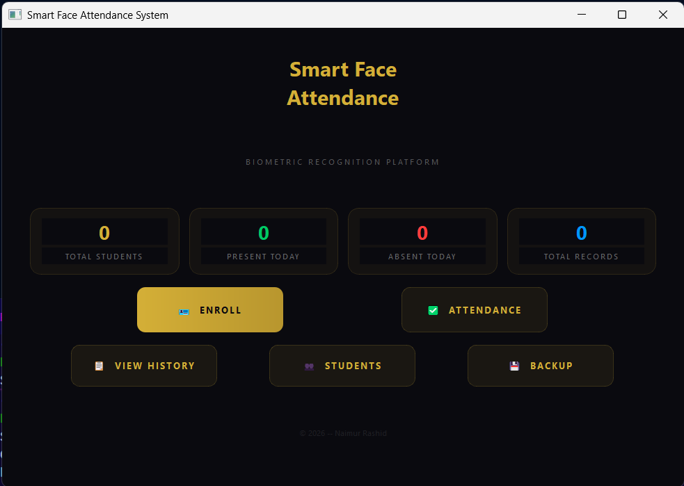
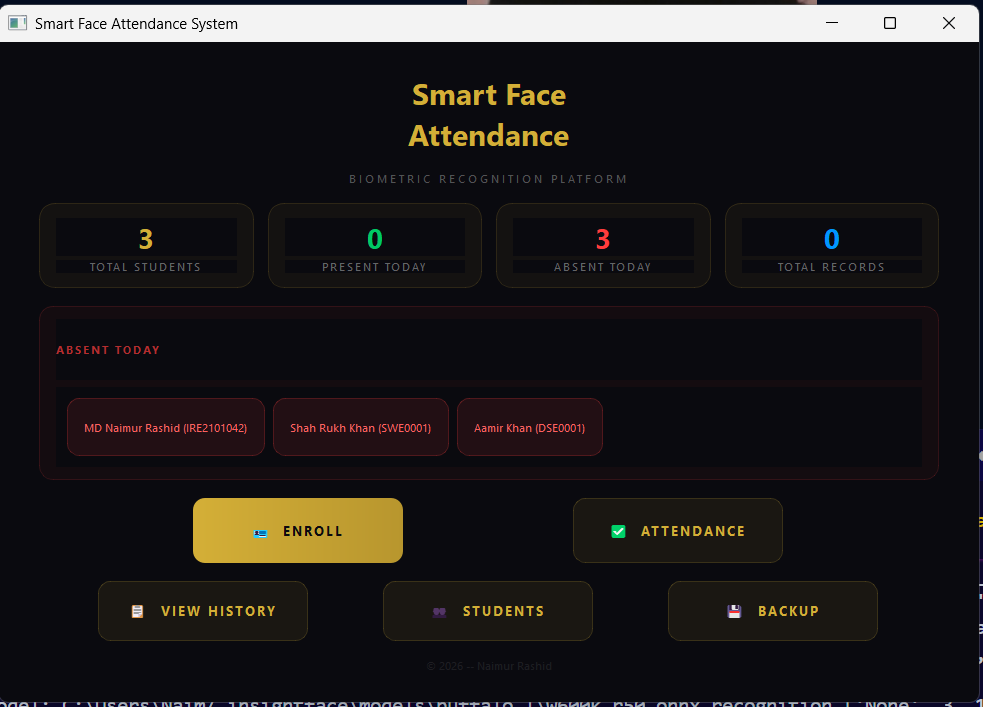
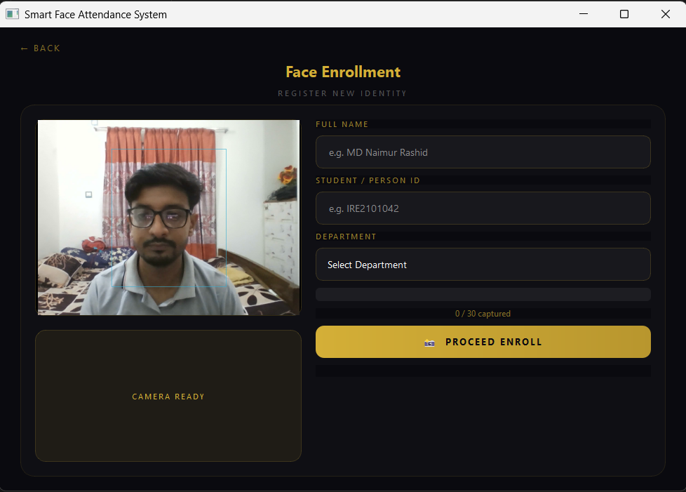
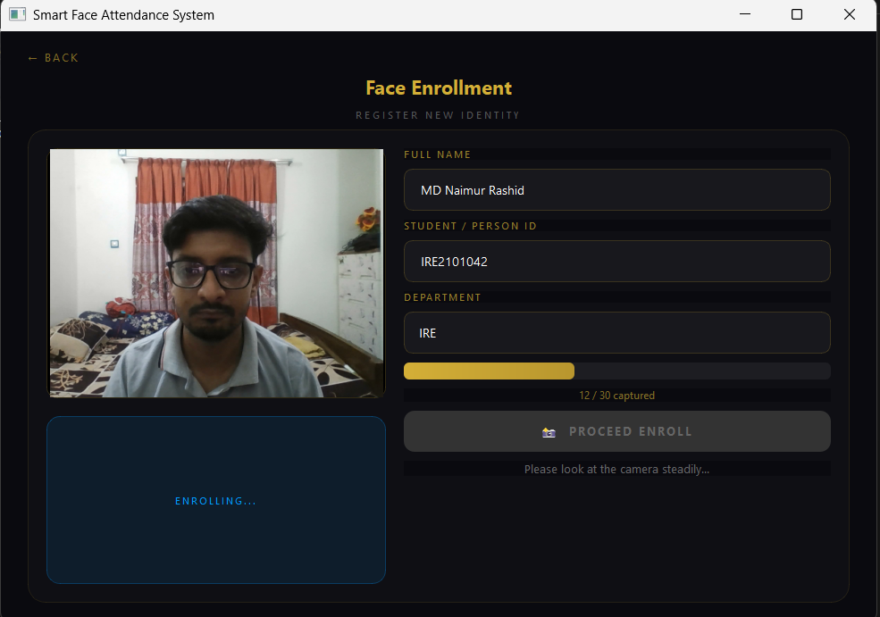
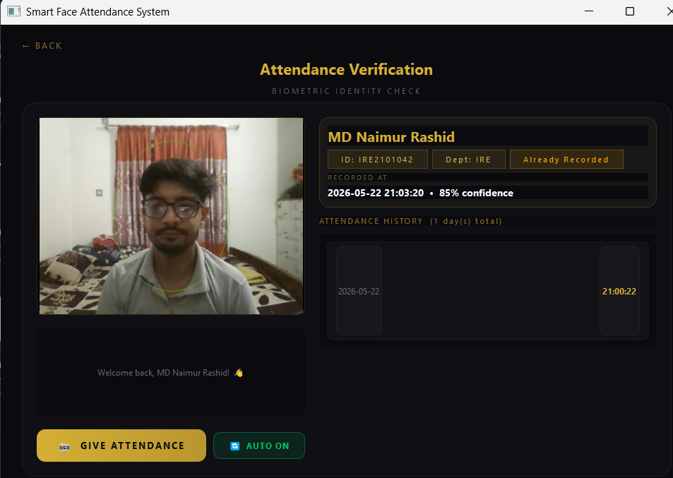
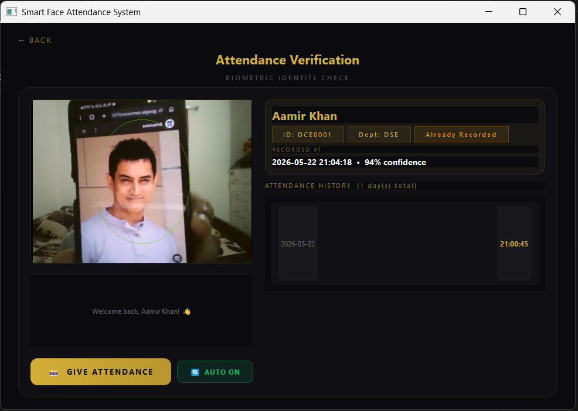
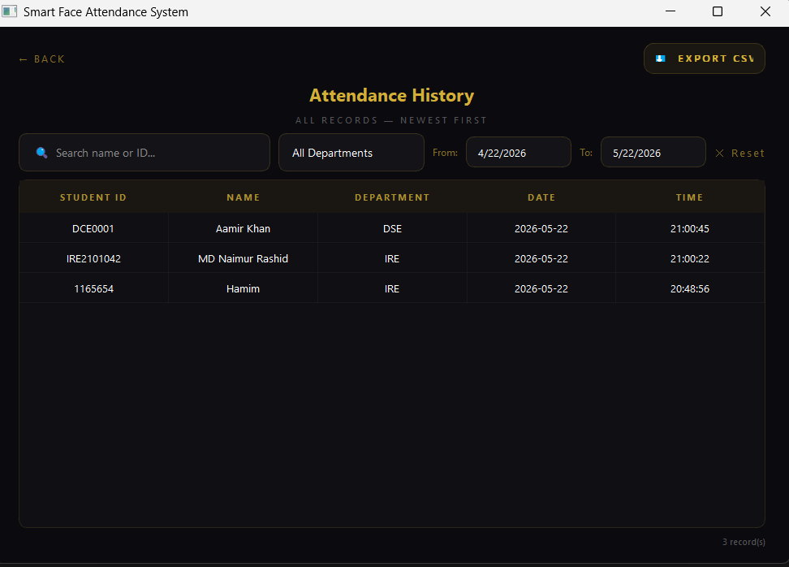
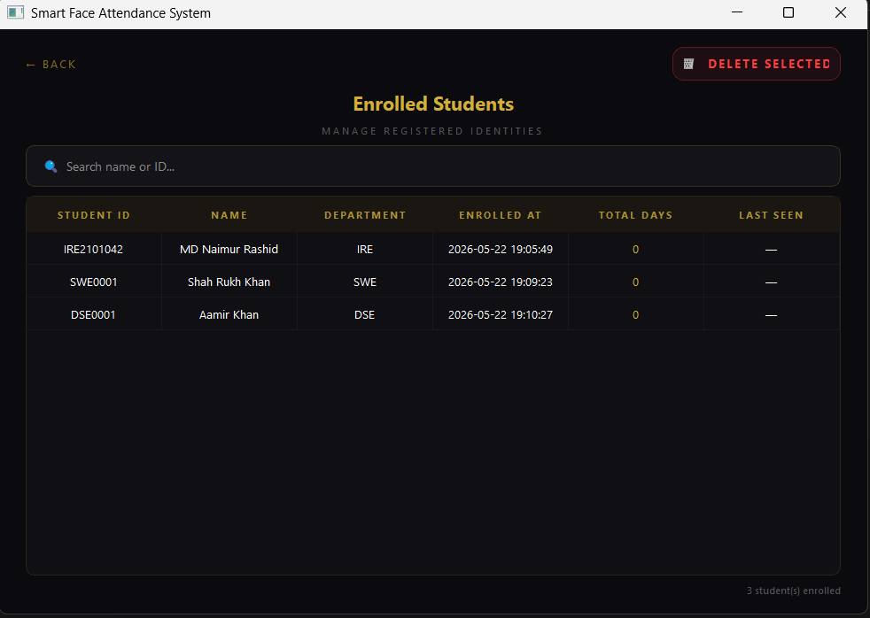
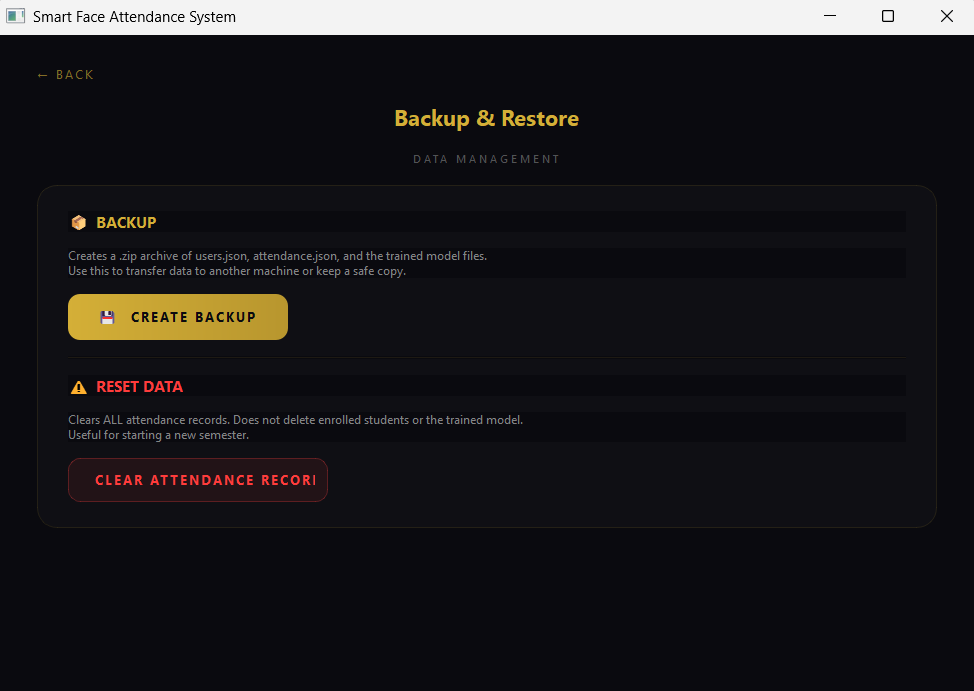

<div align="center">


<br/><br/>

```
  ███████╗███╗   ███╗ █████╗ ██████╗ ████████╗    ███████╗ █████╗  ██████╗███████╗
  ██╔════╝████╗ ████║██╔══██╗██╔══██╗╚══██╔══╝    ██╔════╝██╔══██╗██╔════╝██╔════╝
  ███████╗██╔████╔██║███████║██████╔╝   ██║       █████╗  ███████║██║     █████╗  
  ╚════██║██║╚██╔╝██║██╔══██║██╔══██╗   ██║       ██╔══╝  ██╔══██║██║     ██╔══╝  
  ███████║██║ ╚═╝ ██║██║  ██║██║  ██║   ██║       ██║     ██║  ██║╚██████╗███████╗
  ╚══════╝╚═╝     ╚═╝╚═╝  ╚═╝╚═╝  ╚═╝   ╚═╝       ╚═╝     ╚═╝  ╚═╝ ╚═════╝╚══════╝
```

# 🎓 Smart Face Attendance System

### *Biometric Recognition Platform — Powered by InsightFace + SVM*

<br/>

> **A fully offline, GPU-accelerated face recognition attendance system built with PyQt5.**  
> Enroll students once, then let the camera do the rest — automatically or on demand.

<br/>

[](https://github.com/)
[](#)
[](#license)
[](#)

</div>

## 🎬 Demo Video

<div align="center">

[](https://youtu.be/f6lqk6oJi48)

**▶ [Watch Full Demo on YouTube](https://youtu.be/f6lqk6oJi48)**

</div>

---

## 📸 Screenshots

---

### 🏠 1. Dashboard — Fresh Start (No Data)



> The **main dashboard** is the first screen you see when the app launches. It shows 4 real-time stat cards at the top:
> - **Total Students** — how many faces are enrolled in the system
> - **Present Today** — how many students have already marked attendance today
> - **Absent Today** — how many enrolled students haven't shown up yet (shown in red)
> - **Total Records** — cumulative attendance entries across all days
>
> From here you can navigate to all 5 sections: **Enroll, Attendance, View History, Students, Backup.**  
> In this screenshot, the system is freshly set up — all stats are at `0`.

---

### 📋 2. Dashboard — With Students & Absent List



> Once students are enrolled, the dashboard populates with live data. Here **3 students are enrolled** and none have given attendance yet for the day — so all 3 appear in the **Absent Today** panel.
>
> Each absent student is shown as a clickable chip with their **name** and **ID** (e.g. `MD Naimur Rashid (IRE2101042)`). This gives the teacher/admin an instant overview of who hasn't shown up before the class even begins.

---

### 📷 3. Face Enrollment — Register New Student



> The **Face Enrollment** page is where new students are registered into the system. The left panel shows a **live camera feed** with a face detection box drawn around the detected face in real-time.
>
> On the right, you fill in:
> - **Full Name** (e.g. MD Naimur Rashid)
> - **Student / Person ID** (e.g. IRE2101042)
> - **Department** — selected from a dropdown (IRE, CSE, DSE, SWE, etc.)
>
> A progress indicator shows `0 / 30 captured`. Once **PROCEED ENROLL** is clicked, the system starts capturing face samples automatically. The bottom-left panel shows the camera status (`CAMERA READY`).

---

### ⚙️ 4. Enrollment — In Progress (Capturing Samples)



> After clicking **PROCEED ENROLL**, the system begins capturing **30 face images** automatically while the student looks at the camera. The golden **progress bar** fills up as each frame is captured (here: `12 / 30 captured`).
>
> The status message below the button reads *"Please look at the camera steadily..."* — guiding the student to stay still.  
> Once all 30 samples are captured, InsightFace extracts **512-dimensional embeddings** from each image and the **SVM classifier retrains automatically** in the background — no manual steps needed.

---

### ✅ 5. Attendance Verification — First Time Recognition



> The **Attendance Verification** page is where students mark their presence. The camera feed on the left shows the live video with a **green circle** drawn around the detected face.
>
> On the right, the recognized student's details appear instantly:
> - **Name:** MD Naimur Rashid
> - **ID:** IRE2101042 | **Dept:** IRE
> - **Confidence:** 85% — how certain the model is about the identity
> - **Attendance History** section shows previous attendance dates and times
>
> The greeting *"Welcome back, MD Naimur Rashid! 👋"* is shown at the bottom. The student can then click **GIVE ATTENDANCE** to manually confirm, or use **AUTO ON** for automatic recording.

---

### 🔁 6. Attendance Verification — Already Recorded



> If a student tries to give attendance **again on the same day**, the system detects the duplicate and shows an **"Already Recorded"** badge (in gold) next to their ID and department.
>
> Here **Aamir Khan (DCE0001, Dept: DSE)** is recognized at **94% confidence** but their attendance was already recorded at `21:00:45`. The attendance history panel on the right shows the existing record for `2026-05-22`.
>
> This **prevents duplicate entries** while still showing the student their recognition was successful.

---

### 🤖 7. Auto Mode & Manual Mode Buttons


> The two action buttons at the bottom of the Attendance page:
>
> - **GIVE ATTENDANCE** *(gold button)* — **Manual mode.** The system recognizes the face and shows the student's details, but waits for a human to click this button to officially record attendance. Useful when the teacher wants to confirm identity before marking.
>
> - **AUTO ON** *(green button)* — **Auto mode.** Once toggled on, the system continuously scans the camera feed and marks attendance **automatically** the moment it confidently recognizes a face — no button click needed. The button turns green to indicate auto mode is active.

---

### 📊 8. Attendance History — Filter & CSV Export



> The **Attendance History** page shows a full log of all recorded attendance entries, sorted newest first. Each row displays: **Student ID, Name, Department, Date, Time.**
>
> Powerful filtering options at the top:
> - 🔍 **Search bar** — filter by student name or ID in real-time
> - 🏢 **Department dropdown** — show only a specific department
> - 📅 **Date range (From / To)** — narrow down to a specific period
> - ✖️ **Reset** — clear all filters instantly
>
> The **EXPORT CSV** button (top right) exports the entire filtered view as a `.csv` file — ready to open in Excel or Google Sheets. The bottom right shows the total record count (`3 record(s)`).

---

### 👥 9. Enrolled Students — Manage Identities



> The **Enrolled Students** page lists every registered student with full details in a table:
> - **Student ID, Name, Department** — identity info
> - **Enrolled At** — exact timestamp when they were registered
> - **Total Days** — how many unique days they've attended (shown in gold)
> - **Last Seen** — the most recent date they gave attendance
>
> A **search bar** at the top lets you filter by name or ID instantly.  
> Selecting any row and clicking **DELETE SELECTED** (red button, top right) removes that student completely — their face dataset, embeddings, and all attendance records are deleted, and the SVM model **retrains automatically.**

---

### 💾 10. Backup & Restore — Data Management



> The **Backup & Restore** page provides two critical data management tools:
>
> **📦 BACKUP** — Creates a `.zip` archive containing:
> - `users.json` (enrolled student profiles)
> - `attendance.json` (all attendance records)
> - `encodings.pkl`, `recognizer.pkl`, `labels.pkl` (trained model files)
>
> This backup can be used to transfer the entire system to another machine or keep a safe copy before making changes.
>
> **⚠️ RESET DATA** — Clears **all attendance records** permanently (with a confirmation dialog). Enrolled students and the trained model are kept intact. This is designed for **starting a fresh semester** — you keep all enrolled faces but wipe the attendance slate clean.

---

## ✨ Features

| Feature | Description |
|---|---|
| 🧠 **Deep Face Recognition** | Uses **InsightFace** (`buffalo_l` / `volo26n`) with 512-dim embeddings |
| 🤖 **Auto Attendance Mode** | Camera continuously scans — marks attendance automatically when a face is recognized |
| 🖐️ **Manual Mode** | Recognizes the face first, then lets the user confirm with **Give Attendance** button |
| 📷 **Live Face Enrollment** | Captures **30 face samples** per student with real-time progress bar |
| 🎓 **Multi-Department Support** | IRE, CySE, DSE, SWE, EdTE, EEE, CSE departments built-in |
| 📈 **Dashboard Stats** | Live count of Total Students, Present Today, Absent Today, Total Records |
| 📋 **Absent List** | Dashboard shows who is absent today with ID and department |
| 🔍 **History & Filtering** | Filter attendance by name/ID, department, and date range |
| 📤 **CSV Export** | Export full attendance history as a `.csv` file in one click |
| 🗑️ **Student Deletion** | Delete a student — removes dataset, embeddings, and retrains model automatically |
| 💾 **Backup System** | Creates a `.zip` of all data (`users.json`, `attendance.json`, model files) |
| 🔄 **Reset / New Semester** | Clear all attendance records without removing enrolled students |
| 📝 **Logging** | All errors logged to `logs/app.log` automatically |
| ⚡ **GPU Acceleration** | Uses CUDA if available, falls back to CPU automatically |
| 🔒 **Thread-Safe** | Camera, attendance writes, and model training all run in background threads |

---

## 🗂️ Project Structure

```
Smart-Face-Attendance/
│
├── 📄 mainT.py                      # Main application — all UI + logic
│
├── 📁 config/
│   └── config.json                  # Paths for model files & camera index
│
├── 📁 data/
│   ├── attendance.json              # All attendance records (per-student history)
│   └── users.json                   # Enrolled student profiles
│
├── 📁 dataset/
│   └── faces/
│       ├── IRE2101042/              # 30 face images per enrolled student
│       ├── DCE0001/
│       └── SWE0001/
│
├── 📁 output/                       # Trained model files (auto-generated)
│   ├── encodings.pkl                # Face embeddings for all enrolled students
│   ├── labels.pkl                   # Label encoder (student ID ↔ integer)
│   └── recognizer.pkl               # Trained SVM classifier
│
├── 📁 logs/
│   └── app.log                      # Error log file
│
├── 📁 screenshots/                  # UI screenshots (used in this README)
│
└── 🤖 volo26n.pt                    # InsightFace model weights
```

---

## ⚙️ How It Works

### 1. 📸 Enrollment
1. Enter the student's **Full Name**, **ID**, and **Department**
2. The camera opens and automatically detects the face
3. **30 face images** are captured and saved to `dataset/faces/<student_id>/`
4. InsightFace extracts **512-dimensional embeddings** from each image
5. An **SVM classifier** (scikit-learn, linear kernel) is trained/retrained on all embeddings
6. Model files saved to `output/` as `encodings.pkl`, `recognizer.pkl`, `labels.pkl`

### 2. ✅ Attendance Verification
1. Camera opens and detects faces in real-time
2. InsightFace extracts the embedding of the detected face
3. The trained SVM predicts the student identity with a **confidence score**
4. **Manual Mode:** Shows the matched name + confidence → user clicks **Give Attendance**
5. **Auto Mode:** Attendance is recorded automatically when confidence threshold is met
6. Duplicate entries for the same day are detected and shown as **"Already Recorded"**

### 3. 📊 Data Storage
- Student profiles stored in `data/users.json`
- Each attendance record includes: `student_id`, `name`, `department`, `date_time`
- All records stored in `data/attendance.json` with full history per student

---

## 🚀 Installation

### Prerequisites

- Python **3.8+**
- Windows or Linux
- Webcam or USB camera
- (Optional but recommended) NVIDIA GPU with CUDA

### 1. Clone the Repository

```bash
git clone https://github.com/your-username/smart-face-attendance.git
cd smart-face-attendance
```

### 2. Install Dependencies

```bash
pip install PyQt5 opencv-python insightface scikit-learn numpy
```

Or install all at once:

```bash
pip install -r requirements.txt
```

> **requirements.txt**
> ```
> PyQt5
> opencv-python
> insightface
> scikit-learn
> numpy
> onnxruntime-gpu   # use onnxruntime (CPU) if no GPU
> ```

### 3. Configure `config/config.json`

```json
{
    "camera_index": 0,
    "encodings_path": "output/encodings.pkl",
    "recognizer_path": "output/recognizer.pkl",
    "le_path": "output/labels.pkl"
}
```

> Change `camera_index` to `1`, `2`, etc. if your primary camera is not the system default.

### 4. Run the Application

```bash
python mainT.py
```

---

## 🖥️ Usage Guide

### Enrolling a New Student
1. Click **ENROLL** on the dashboard
2. Fill in **Full Name**, **Student/Person ID**, and **Department**
3. Click **PROCEED ENROLL** — the camera will capture 30 face samples
4. Wait for training to complete — the model retrains automatically

### Taking Attendance
1. Click **ATTENDANCE** on the dashboard
2. Look at the camera — your face will be recognized
3. **Manual:** Click **GIVE ATTENDANCE** to confirm
4. **Auto Mode:** Toggle **AUTO ON** — attendance records itself

### Viewing History
1. Click **VIEW HISTORY** on the dashboard
2. Search by name or ID, filter by department and date range
3. Click **EXPORT CSV** to download records as a spreadsheet

### Managing Students
1. Click **STUDENTS** to see all enrolled identities
2. Select a student row and click **DELETE SELECTED** to remove them
   - Deletes their face dataset, embeddings, and retrains the model

### Backup & Reset
1. Click **BACKUP** on the dashboard
2. **Create Backup** — saves a `.zip` of all data and model files
3. **Clear Attendance Records** — resets attendance for a new semester (keeps enrolled students)

---

## 📁 Output Files Explained

| File | Description |
|---|---|
| `output/encodings.pkl` | Dictionary containing all face **embedding vectors** (numpy arrays) and corresponding student IDs |
| `output/recognizer.pkl` | Trained **SVM model** (sklearn `SVC`, linear kernel) that maps embeddings to student identities |
| `output/labels.pkl` | **LabelEncoder** object that maps student ID strings ↔ integer class indices used by the SVM |

> These files are auto-generated during enrollment and updated whenever a student is added or deleted. You do **not** need to create them manually.

---

## 🛠️ Tech Stack

| Component | Technology |
|---|---|
| **UI Framework** | PyQt5 (QStackedWidget-based SPA) |
| **Face Detection & Embedding** | InsightFace (`FaceAnalysis`, ONNX backend) |
| **Face Recognition** | scikit-learn `SVC` (Linear SVM) |
| **Camera Handling** | OpenCV (`cv2.VideoCapture`) |
| **Data Storage** | JSON files (no database required) |
| **Threading** | Python `threading` module (camera + training in background) |
| **Accelerator** | CUDA (NVIDIA GPU) / CPU fallback |
| **Model Serialization** | `pickle` |

---

## 🔧 Troubleshooting

**Camera not opening?**
- Check `camera_index` in `config/config.json` (try `0`, `1`, `2`)

**Low recognition accuracy?**
- Re-enroll the student in better lighting
- Make sure the face is centered during enrollment

**Training fails with "Need 2+ people"?**
- At least **2 different students** must be enrolled before the SVM can train

**CUDA errors?**
- Install `onnxruntime-gpu` instead of `onnxruntime`
- Or the system will automatically fall back to CPU

---

## 📄 License

This project is licensed under the **MIT License** — see the [LICENSE](LICENSE) file for details.

---

<div align="center">

**© 2026 — Naimur Rashid**

*Built with ❤️ using Python, InsightFace & PyQt5*

</div>
